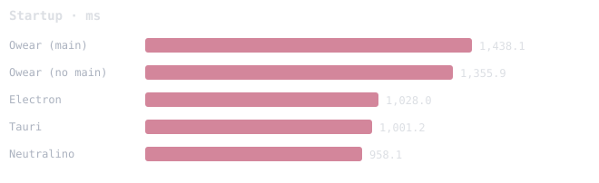
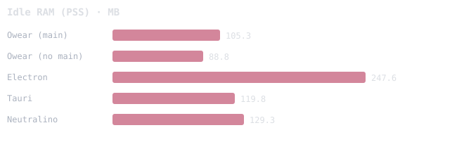
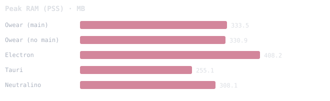
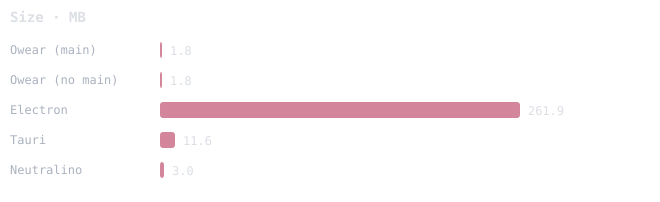
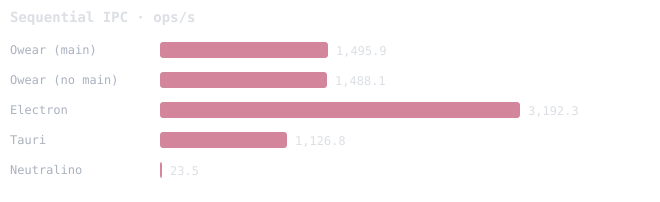
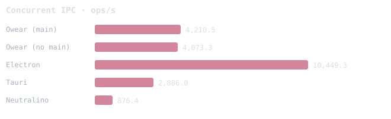
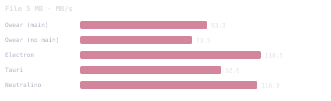
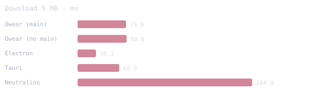
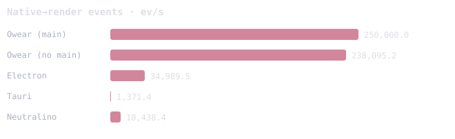
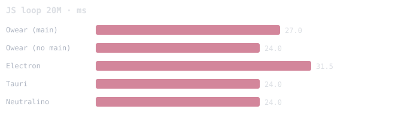

# Benchmarks — Owear vs Electron vs Tauri vs Neutralino

**Mediana de 3 repeticiones intercaladas** (round-robin) + 1 de warmup descartada.
Misma máquina (Linux, Xvfb 1280×800 compartido, GPU software). Arranque por **marcador** (5 ms);
memoria en **PSS** (proporcional). Reproducir: `python3 benchmarks/run.py --warmup 1 --repeat 3`.
Metodología y caveats: `benchmarks/README.md`. Crudo + entorno: `results.json`.

> Electron embebe **Chromium**; Owear/Tauri/Neutralino usan el **WebView del SO** (WebKitGTK). GPU software en todos.
> Owear "sin main" no arranca el sidecar Node. Neutralino usa una **extensión propia** para el IPC.
> Entorno: Intel(R) Core(TM) i3-3240 CPU @ 3.40GHz · 4 cores · governor schedutil · kernel 6.8.0-134-generic · WebKitGTK 2.52.6

## Startup, memory and size

| Framework | Startup (ms) | Idle RAM (MB) | Peak RAM (MB) | Processes | Size (MB) |
|---|---:|---:|---:|---:|---:|
| Owear (main) | 1,438 | 105.3 | 333.5 | 4 | 1.8 |
| Owear (no main) | 1,356 | 88.8 | 330.9 | 3 | 1.8 |
| Electron | 1,028 | 247.6 | 408.2 | 7 | 261.9 |
| Tauri | 1,001 | 119.8 | 255.1 | 3 | 11.6 |
| Neutralino | 958 | 129.3 | 308.1 | 5 | 3 |

## IPC — small round-trip (sequential)

| Framework | ops/s | median (ms) | p95 (ms) | p99 (ms) |
|---|---:|---:|---:|---:|
| Owear (main) | 1,496 | 1 | 2 | 3 |
| Owear (no main) | 1,488 | 1 | 2 | 3 |
| Electron | 3,192 | 0.2 | 0.6 | 1.7 |
| Tauri | 1,127 | 1 | 2 | 4 |
| Neutralino | 23 | 42 | 45 | 48 |

## IPC — concurrent (2000 in batches of 50)

| Framework | ops/s |
|---|---:|
| Owear (main) | 4,211 |
| Owear (no main) | 4,073 |
| Electron | 10,449 |
| Tauri | 2,886 |
| Neutralino | 876 |

## Payload — text echo round-trip (median ms)

| Framework | 1 KB | 64 KB | 1 MB | 5 MB |
|---|---:|---:|---:|---:|
| Owear (main) | 1 | 3 | 28 | 144 |
| Owear (no main) | 1 | 3 | 29 | 152 |
| Electron | 0.3 | 2.4 | 11.5 | 58.9 |
| Tauri | 1 | 4 | 27 | 113 |
| Neutralino | 42 | 50 | 111 | 566 |

## File — read 5 MB native→renderer

| Framework | median (ms) | MB/s |
|---|---:|---:|
| Owear (main) | 60 | 83.3 |
| Owear (no main) | 68 | 73.5 |
| Electron | 42 | 118.5 |
| Tauri | 54 | 92.6 |
| Neutralino | 43 | 116.3 |

## Download — 1 MB / 5 MB response (median ms)

| Framework | 1 MB | 5 MB |
|---|---:|---:|
| Owear (main) | 20 | 79 |
| Owear (no main) | 21 | 80 |
| Electron | 6 | 30 |
| Tauri | 14 | 68 |
| Neutralino | 82 | 284 |

## Native → renderer events (5000)

| Framework | ms | events/s |
|---|---:|---:|
| Owear (main) | 20 | 250,000 |
| Owear (no main) | 21 | 238,095 |
| Electron | 143 | 34,990 |
| Tauri | 3,646 | 1,371 |
| Neutralino | 479 | 10,438 |

## JS compute (engine)

| Framework | loop 20M (ms) | sort 2M (ms) |
|---|---:|---:|
| Owear (main) | 27 | 1,054 |
| Owear (no main) | 24 | 1,055 |
| Electron | 32 | 2,215 |
| Tauri | 24 | 1,081 |
| Neutralino | 24 | 1,009 |

## Packaged artifacts (MB)

| Artifact | MB |
|---|---:|
| Owear — app (single binary) | 1.9 |
| Owear — installer | — |
| Owear — uninstaller | — |
| Electron — framework (dist) | 261.9 |
| Tauri — binary | 11.6 |
| Neutralino — dist (bin + resources.neu) | 21.8 |

> Owear/Tauri/Neutralino do **not** bundle the system WebView (they use the OS one); Electron ships Chromium. Owear's installer includes the installer + the app payload.

## Relative performance (% — baseline = Electron = 100; < 100 = better)

Each cell is `cost(frame) / cost(Electron) × 100`, with the cost normalized
(lower is better; for ops/s it's inverted). **Lower than 100% = better than Electron.**

| Metric | Owear | Owear (no main) | Tauri | Neutralino | Electron |
|---|---:|---:|---:|---:|---:|
| Startup | 140% | 132% | 97% | 93% | 100% |
| Idle RAM (PSS) | 43% | 36% | 48% | 52% | 100% |
| Peak RAM (PSS) | 82% | 81% | 62% | 75% | 100% |
| Size | 1% | 1% | 4% | 1% | 100% |
| Sequential IPC | 213% | 215% | 283% | 13,603% | 100% |
| Concurrent IPC | 248% | 257% | 362% | 1,192% | 100% |
| Payload 1 MB | 243% | 252% | 235% | 965% | 100% |
| File 5 MB | 142% | 161% | 128% | 102% | 100% |
| Download 5 MB | 261% | 264% | 224% | 937% | 100% |
| Native→render events | 14% | 15% | 2,551% | 335% | 100% |
| JS loop 20M | 86% | 76% | 76% | 76% | 100% |

**Owear's net score vs Electron: 70%** (< 100% = better overall; geometric mean of 11 zones).

## Charts

### Startup (ms)

### Idle RAM (PSS) (MB)

### Peak RAM (PSS) (MB)

### Size (MB)

### Sequential IPC (ops/s)

### Concurrent IPC (ops/s)

### Payload 1 MB (ms)

### File 5 MB (MB/s)

### Download 5 MB (ms)

### Native→render events (ev/s)

### JS loop 20M (ms)

---
Generado por `benchmarks/make_tables.py`.
